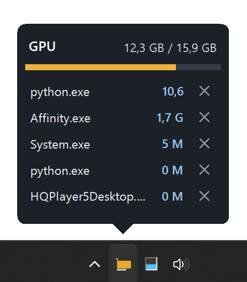

# GPU Memory Tray

A small Windows tray application for monitoring NVIDIA GPU memory. Hovering over the icon shows a dark panel with total VRAM usage, a colored saturation bar, and a list of GPU processes sorted by memory usage.



## Build and Run

```powershell
& 'C:\Program Files\dotnet\dotnet.exe' publish -c Release
Start-Process .\bin\Release\net8.0-windows\publish\GpuMemTray.exe
```

The application uses the `nvidia-smi` command (installed by the NVIDIA driver) when available, and falls back to Windows' `GPU Process Memory` performance counter if it is not. The right-click menu allows toggling the percentage icon and automatic Windows startup.

## Note

In Windows WDDM mode, some versions of the NVIDIA driver do not return per-process VRAM usage via `nvidia-smi`. In such cases, the application reads dedicated VRAM from Windows' own `GPU Process Memory` counter.